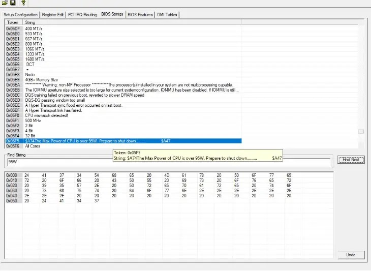
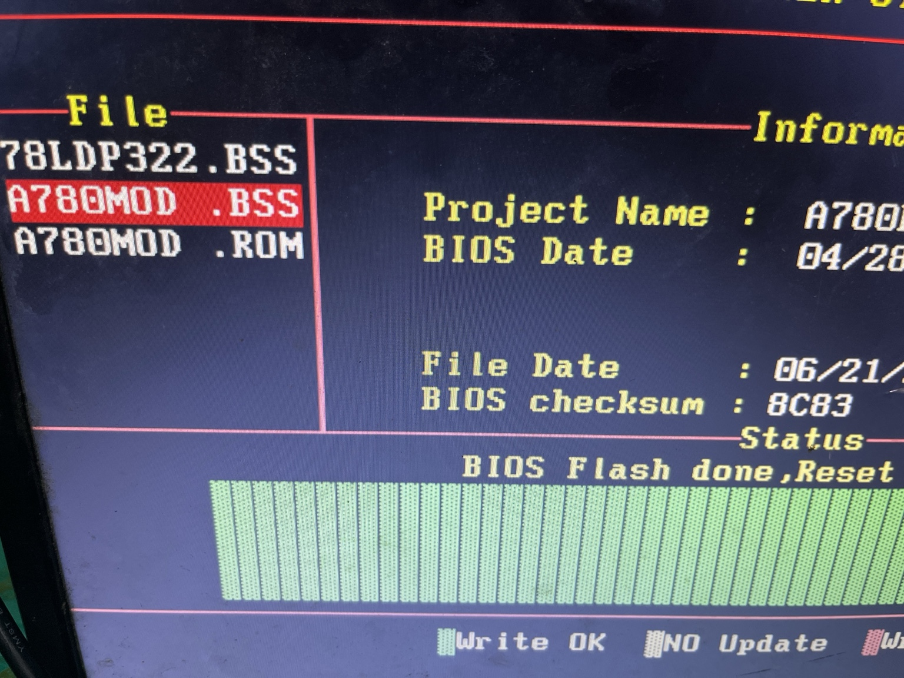
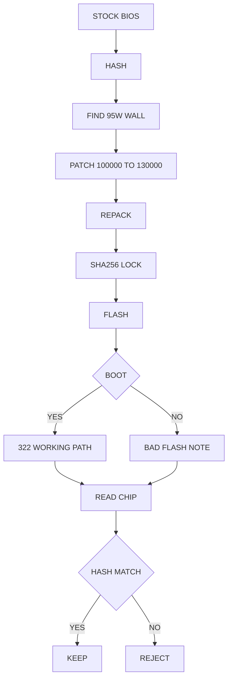

# DBYTE A780L3B BIOS RESEARCH

```text
BOARD  : BIOSTAR A780L3B / 78LDPXXX
TARGET : 95W WALL -> 125W TABLE
STATE  : 322 PATH WORKS
RULE   : HASH FILE. READ CHIP. DO NOT GUESS.
```

## PROOF

<p align="center">
  
</p>

<p align="center">
  
</p>

## FILES

- [A780MOD.BSS](https://github.com/Deadbytes101/dbyte-a780l3b-bios-research/releases/download/A780-125W/A780MOD.BSS)
- [A780MOD.ROM](https://github.com/Deadbytes101/dbyte-a780l3b-bios-research/releases/download/A780-125W/A780MOD.ROM)

```text
SHA256 DBEF5C4AFCBBF83C76276B52D293B6EB034EA224629753DF6FE52DAAB5DBE628
```

## CUT

```text
100000 -> 130000
A0 86 01 00 -> D0 FB 01 00
```

## PIPELINE



## HASH WALL

```text
A780MOD.BSS                         DBEF5C4AFCBBF83C76276B52D293B6EB034EA224629753DF6FE52DAAB5DBE628
A780MOD.ROM                         DBEF5C4AFCBBF83C76276B52D293B6EB034EA224629753DF6FE52DAAB5DBE628
a780l3b-322-threshold-130000.rom    DBEF5C4AFCBBF83C76276B52D293B6EB034EA224629753DF6FE52DAAB5DBE628

ORIG322.BSS                         0E811F3F70D47C47C75293CD163335589DE4CA754E99E7CA80FCEEF23658BCA4
78LDP428.rom                        955798C808809341857C84CD3E1EC2DCC89CEC1098FC923FE048D2ADC3BE262D
78LDP428-T130.rom                   81665274B955B1139F02FAC129E544BB575B00F85DA6B72ED8A3B6106E24CF79
```

## NOT USED

```text
FULL ROM DIFF PATCH SOURCE: NO
DIFF_COUNT : 149788
FIRST_DIFF : 0x0486D4
LAST_DIFF  : 0x0FFFFC
```

## REJECTED

```text
428-S95 BRANCH SKIP
0x019249: 0F 84 99 00 -> E9 9A 00 90
STATUS: REJECTED
```

## BAD FLASH

```text
NO VIDEO
BEEP BEEP -- BEEP BEEP BEEP BEEP
SOMETIMES ONE LATE BEEP
POWER-OFF AFTER SHORT TIME
USB RECOVERY DID NOT START
```

INCOMPLETE WRITE UNTIL CHIP READBACK SAYS OTHERWISE.
